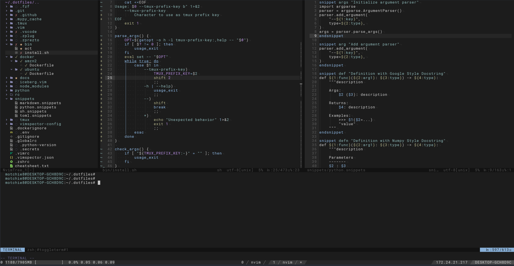

# dotfiles



This is my personal collection of configuration files.

* Shell: zsh
* Editor: Neovim

## How to install

Install on local machine on MacOS or Ubuntu.

```sh
$ ./bin/install.sh -t b
```

Show help message
```sh
$ ./bin/install.sh -h
Usage: ./bin/install.sh -t TMUX_PREFIX_KEY
  -h                    Show this help message and exit
  -b                    Build Neovim from source
  -t TMUX_PREFIX_KEY    Specify prefix Key for tmux. ex. "-t b"
```

## Docker image
Launch a Docker container from a public docker image.

Currently, only the Ubuntu image is available.

```sh
$ docker run -it --rm -v $(pwd):/mnt/host motchie8/dotfiles:master zsh
```
